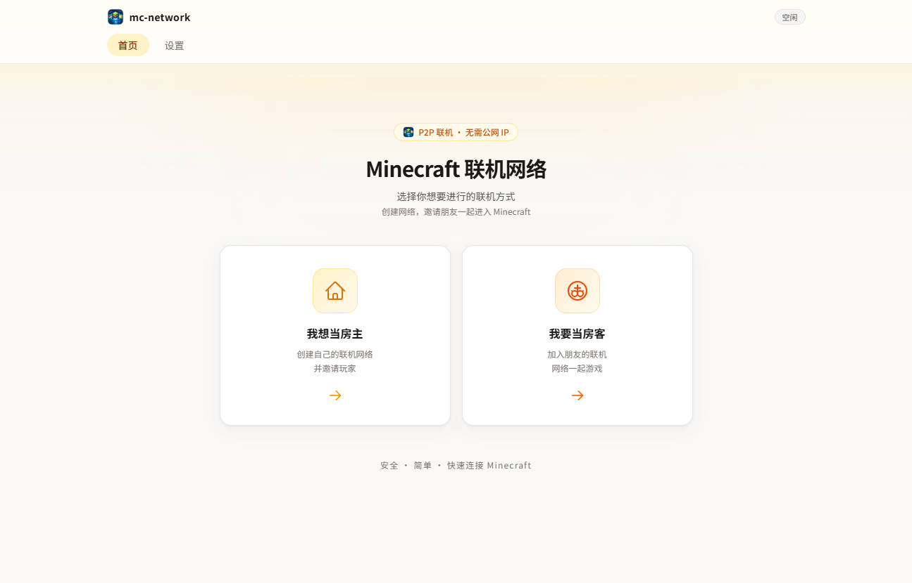

# mc 网络联机



**Minecraft Java 版 P2P 联机网络小工具**——无需公网 IP、无需配置路由器，创建一个加密的 P2P 虚拟局域网，让朋友像在同一个局域网里一样直连你的 MC 世界。

## 项目简介

mc-network 是一个 Windows 桌面应用（Tauri 2 + Vue 3），内嵌 [EasyTier](https://github.com/EasyTier/EasyTier) v2.6.4 官方二进制，为 Minecraft Java 版搭建 P2P 联机通道。两端各跑一个小工具：

- **当房主**：在 MC 里「对局域网开放」后，创建网络。工具会自动嗅探 MC 的局域网广播拿到端口，并只放行该端口（tcp/udp 白名单），其余流量一律不进。
- **当房客**：粘贴房主分享的连接信息（网络名 + 密码 [+ 端口]），加入同一网络。工具把本机 `0.0.0.0:<MC端口>` 转发到房主的虚拟 IP，随后在本机广播 MC「局域网游戏」入口——打开 MC「多人游戏 → 局域网游戏」直接点击进入，也可以直连 `127.0.0.1:<MC端口>`。

## 功能特性

- 双模式互斥：服务端（房主）/ 客户端（房客），同一时刻只跑一个网络
- 房主端自动嗅探 MC 局域网广播（上限 30s），拿不到端口不创建，避免空转
- 房客端本地探活通过后才广播局域网入口，不会出现「看得到进不去」的房间
- 网络名 / 密码随机生成（`XXXX-XXXX` / `XXXX-XXXX`），支持手动填写
- 一键复制 / 粘贴连接信息（含 MC 端口），方便发给朋友
- 公网节点管理：增删改、localStorage 持久化、一键恢复默认 4 条
- 系统托盘常驻：关闭窗口隐藏到托盘，托盘菜单「退出」才是真退出
- 全程无黑色控制台弹窗，EasyTier 二进制运行时解压到临时目录、退出自动清理

## 技术栈

| 层 | 技术 |
|---|---|
| 桌面壳 | Tauri 2（Rust） |
| 前端 | Vue 3 + Tailwind CSS v4 + Vite 8 |
| 组网 | EasyTier v2.6.4（构建期下载官方 zip，压缩嵌入 exe） |
| 测试 | cargo test（Rust 单测）+ vitest（前端单测） |

## 运行环境

- **Windows x86_64**（仅支持此平台）
- [Rust](https://rustup.rs) stable（MSVC 工具链，需装 Visual Studio Build Tools 的 C++ 生成工具）
- [Node.js](https://nodejs.org) 20+ 与 yarn（`npm i -g yarn`）
- WebView2 Runtime（Win10/11 一般自带）
- **首次构建需联网**：`build.rs` 会从 GitHub Releases 下载 EasyTier v2.6.4 官方 zip，缓存到 `src-tauri/.easytier/`（已 gitignore），之后离线可重复构建

## 开发调试

```bash
yarn install        # 安装前端依赖
yarn tauri dev      # 启动开发模式（自动跑 vite + 编译 Rust，热更新前端）
```

## 编译打包

```bash
yarn install
yarn tauri build    # 先 yarn build 打包前端，再编译 Rust 并产出安装包
```

产物位置（`src-tauri/target/release/`）：

| 路径 | 内容 |
|---|---|
| `mc-network.exe` | 可直接运行的绿色单文件主程序 |
| `bundle/nsis/mc-network_0.1.1_x64-setup.exe` | NSIS 安装包 |
| `bundle/msi/mc-network_0.1.1_x64_en-US.msi` | MSI 安装包 |

## License

MIT
